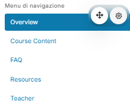

# Course Tabs Plugin for Moodle

## Overview

The **Course Tabs** plugin enhances the organization of Moodle courses by introducing a tabbed interface that improves navigation and user experience for both students and teachers.

While the Universe theme creates 5 tabs that can be displayed on the main course page, these tabs disappear when you open an activity or resource. This plugin resolves the issue by allowing you to create a block within any course page or activity/resource page. The block ensures that the tabs are always visible, providing consistent navigation throughout the course.

## Features

- Displays course content in an organized tabbed format.
- Ensures the tabs created by the Universe theme are always visible, even within course activities or resources.
- Easy to integrate and configure within Moodle.
- Supports multilingual environments with language files.

## Requirements

- **Moodle Version**: 3.9 or higher (minimum version `2020061500`).
- **Theme**: Requires the `theme_universe` plugin (any version).

## Installation

There are two ways to install the **Course Tabs** plugin:

### Method 1: Manual Installation

1. Download the plugin and extract the files.
2. Place the extracted folder (`coursetabs`) in the `/blocks` directory of your Moodle installation.
3. Log in to your Moodle site as an administrator.
4. Navigate to **Site administration > Notifications** to complete the installation process.

### Method 2: Install via ZIP File from Moodle Dashboard

1. Download the plugin ZIP file.
2. Log in to your Moodle site as an administrator.
3. Navigate to **Site administration > Plugins > Install plugins**.
4. Drag and drop the ZIP file into the file picker or click **Choose a file...** to upload the ZIP file.
5. Click **Install plugin from ZIP file**.
6. Follow the on-screen instructions to complete the installation.
7. After installation, go to **Site administration > Notifications** to finalize the process.

## Customization

- The `styles` directory and `style.css` file are optional. By default, the plugin includes these files in an empty state. Users with CSS knowledge can modify the `style.css` file in the `styles` directory located directly within the plugin's directory to customize the plugin's appearance.  
  **Important:** Upon updating the plugin, the `style.css` file will be replaced or deleted. Be sure to back up the file before performing any updates.

- Alternatively, CSS customizations can be applied directly from the theme. In Moodle's frontend, the reference class for styling is `coursetabs-links`.

- Use the `lang` directory to add or update language support for the plugin.

## Licensing

This plugin is licensed under the [GNU GPL v3](https://www.gnu.org/licenses/gpl-3.0.html). Please ensure compliance with the licensing terms of Moodle.

## Contributing

Contributions are welcome! Here’s how you can help:

1. Fork this repository.
2. Create a feature branch: `git checkout -b feature-name`.
3. Commit your changes: `git commit -m 'Add feature'`.
4. Push to the branch: `git push origin feature-name`.
5. Open a pull request.

### Additional Contributions

- If you test the plugin on other versions of Moodle or the Universe theme, please share your findings. This would help improve the documentation and ensure compatibility with a wider range of configurations.
- Suggestions for improvements or reporting issues are always appreciated.

## Support

For questions or suggestions, contact **Marco Traina** at [marco.traina@outlook.it](mailto:marco.traina@outlook.it) or open an issue on GitHub.

## Screenshots

---

This plugin adheres to Moodle's plugin development guidelines and best practices. Ensure that your Moodle installation is properly backed up before installing or updating any plugin.
